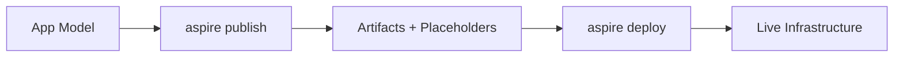

import { Aside, Steps, Tabs, TabItem } from '@astrojs/starlight/components';
import LearnMore from '@components/LearnMore.astro';

## Overview

This guide covers production-grade deployment strategies for .NET Aspire applications. It assumes familiarity with containerization, cloud infrastructure, and DevOps practices.

### Core Concepts

Aspire separates publishing (artifact generation) from deployment (resource provisioning and application delivery):

- **`aspire publish`**: Generates parameterized deployment artifacts (Docker Compose, K8s manifests, Azure specs)
- **`aspire deploy`**: Executes deployment with parameter resolution and resource provisioning (integration-dependent)



### Platform Support Matrix

| Platform | Publish | Deploy | Ideal For |
|----------|---------|--------|-----------|
| Azure Container Apps | ✅ | ✅ | Serverless containers, auto-scaling, managed infrastructure |
| Azure App Service | ✅ | ✅ | Traditional web apps, legacy migration |
| Docker Compose | ✅ | ❌ | Local dev, self-hosted, edge deployments |
| Kubernetes | ✅ | ❌ | Enterprise orchestration, multi-cloud, on-prem |

## Prerequisites

### Required Tools

```bash
# Verify .NET SDK
dotnet --version  # 9.0+

# Verify Aspire CLI
aspire --version

# Azure deployments
az --version
az account show

# Docker deployments
docker --version
docker compose version

# Kubernetes deployments
kubectl version --client
helm version  # Optional but recommended
```

### Development Environment

```bash
# Install Aspire workload
dotnet workload install aspire

# Install Aspire CLI
dotnet tool install -g aspire

# Update existing installation
dotnet tool update -g aspire
```

## Architecture Patterns

### Single Environment Deployment

All resources deploy to one compute environment:

```csharp title="Program.cs"
var builder = DistributedApplication.CreateBuilder(args);

var azure = builder.AddAzureContainerAppsEnvironment("production");

builder.AddProject<Projects.Api>("api")
    .WithComputeEnvironment(azure);

builder.AddProject<Projects.Web>("web")
    .WithComputeEnvironment(azure);
```

### Hybrid Multi-Environment Deployment

Different services deploy to different platforms:

```csharp title="Program.cs"
var builder = DistributedApplication.CreateBuilder(args);

var azure = builder.AddAzureContainerAppsEnvironment("cloud");
var k8s = builder.AddKubernetesEnvironment("on-prem");

// Public-facing services to Azure
builder.AddProject<Projects.PublicApi>("public-api")
    .WithComputeEnvironment(azure)
    .WithExternalHttpEndpoints();

// Internal services to on-prem Kubernetes
builder.AddProject<Projects.InternalService>("internal-svc")
    .WithComputeEnvironment(k8s);

// Shared database on Azure
var db = builder.AddPostgres("postgres")
    .WithComputeEnvironment(azure)
    .PublishAsAzurePostgresFlexibleServer();
```

## Deployment Strategy 1: Azure Container Apps

### Architecture Overview

Azure Container Apps provides serverless containers with:
- Automatic HTTPS/TLS termination
- Built-in load balancing and auto-scaling
- Managed VNET integration
- Dapr integration for microservices patterns

### Implementation

#### 1. Configure AppHost

```csharp title="AppHost/Program.cs"
var builder = DistributedApplication.CreateBuilder(args);

// Define Azure environment
var azure = builder.AddAzureContainerAppsEnvironment("aca-env");

// Infrastructure resources
var postgres = builder.AddPostgres("postgres")
    .WithComputeEnvironment(azure)
    .PublishAsAzurePostgresFlexibleServer();

var db = postgres.AddDatabase("appdb");

var redis = builder.AddRedis("cache")
    .WithComputeEnvironment(azure)
    .PublishAsAzureRedis();

// Application services
var api = builder.AddProject<Projects.ApiService>("api")
    .WithComputeEnvironment(azure)
    .WithReference(db)
    .WithReference(redis)
    .WithEnvironment("ASPNETCORE_ENVIRONMENT", builder.Configuration["ASPNETCORE_ENVIRONMENT"] ?? "Production");

builder.AddProject<Projects.WebFrontend>("web")
    .WithComputeEnvironment(azure)
    .WithReference(api)
    .WithExternalHttpEndpoints();

builder.Build().Run();
```

#### 2. Configure Package Reference

```xml title="AppHost/AppHost.csproj"
<Project Sdk="Microsoft.NET.Sdk">
  <PropertyGroup>
    <OutputType>Exe</OutputType>
    <TargetFramework>net9.0</TargetFramework>
    <IsAspireHost>true</IsAspireHost>
  </PropertyGroup>

  <ItemGroup>
    <PackageReference Include="Aspire.Hosting.AppHost" Version="9.2.0" />
    <PackageReference Include="Aspire.Hosting.Azure.AppContainers" Version="9.2.0" />
    <PackageReference Include="Aspire.Hosting.Azure.PostgreSQL" Version="9.2.0" />
    <PackageReference Include="Aspire.Hosting.Azure.Redis" Version="9.2.0" />
  </ItemGroup>

  <ItemGroup>
    <ProjectReference Include="..\ApiService\ApiService.csproj" />
    <ProjectReference Include="..\WebFrontend\WebFrontend.csproj" />
  </ItemGroup>
</Project>
```

#### 3. Initial Deployment

```bash
# Navigate to AppHost
cd src/YourApp.AppHost

# Authenticate to Azure
az login
az account set --subscription "your-subscription-id"

# Execute deployment
aspire deploy --environment production

# Provide when prompted:
# - Subscription ID: <your-subscription-id>
# - Resource Group: rg-yourapp-prod
# - Location: eastus (or preferred region)
```

Deployment state caches to `~/.aspire/deployments/<AppHostSha>/production.json`.

#### 4. Subsequent Deployments

```bash
# Uses cached configuration
aspire deploy --environment production

# Or for staging
aspire deploy --environment staging
```

#### 5. Production Configuration

Create environment-specific settings:

```json title="appsettings.Production.json"
{
  "Logging": {
    "LogLevel": {
      "Default": "Information",
      "Microsoft.AspNetCore": "Warning"
    }
  },
  "AllowedHosts": "*",
  "OpenTelemetry": {
    "ServiceName": "api-service",
    "EnableConsoleExporter": false
  }
}
```

#### 6. Post-Deployment Verification

```bash
# List deployed Container Apps
az containerapp list \
  --resource-group rg-yourapp-prod \
  --query "[].{Name:name, FQDN:properties.configuration.ingress.fqdn, Status:properties.runningStatus}" \
  --output table

# View logs in real-time
az containerapp logs show \
  --name api \
  --resource-group rg-yourapp-prod \
  --follow

# Check revision health
az containerapp revision list \
  --name api \
  --resource-group rg-yourapp-prod \
  --output table
```

#### 7. Scaling Configuration

```bash
# Configure auto-scaling rules
az containerapp update \
  --name api \
  --resource-group rg-yourapp-prod \
  --min-replicas 2 \
  --max-replicas 20 \
  --scale-rule-name http-rule \
  --scale-rule-type http \
  --scale-rule-http-concurrency 100

# Configure CPU/memory limits
az containerapp update \
  --name api \
  --resource-group rg-yourapp-prod \
  --cpu 1.0 \
  --memory 2.0Gi
```

### Production Considerations

<Aside type="tip">
**Cost Optimization**: Use consumption plan for variable workloads. Dedicated plan provides reserved capacity for predictable costs.
</Aside>

**Networking**:
- Enable VNET integration for secure communication
- Use managed identities for Azure service authentication
- Configure private endpoints for databases

**Monitoring**:
- Container Apps auto-integrates with Application Insights
- Configure alerts for replica count, response times, and errors
- Use Azure Monitor Workbooks for dashboards

**Security**:
- Enable managed identities (avoid connection strings)
- Use Azure Key Vault for secrets
- Enable container image scanning
- Configure IP restrictions for ingress

## Deployment Strategy 2: Docker Compose (Self-Hosted)

### Architecture Overview

Best for:
- On-premises deployments
- Edge computing scenarios
- Development/testing environments
- Cost-sensitive workloads
- Air-gapped environments

### Implementation

#### 1. Configure AppHost

```csharp title="AppHost/Program.cs"
var builder = DistributedApplication.CreateBuilder(args);

var docker = builder.AddDockerComposeEnvironment("docker");

var postgres = builder.AddPostgres("postgres", password: builder.AddParameter("postgres-password", secret: true))
    .WithComputeEnvironment(docker)
    .WithDataVolume()
    .WithPgAdmin();

var db = postgres.AddDatabase("appdb");

var redis = builder.AddRedis("cache")
    .WithComputeEnvironment(docker)
    .WithDataVolume();

var api = builder.AddProject<Projects.ApiService>("api")
    .WithComputeEnvironment(docker)
    .WithReference(db)
    .WithReference(redis)
    .WithHttpsEndpoint(port: 5001, targetPort: 8080, name: "https")
    .WithEnvironment("ASPNETCORE_ENVIRONMENT", "Production");

builder.AddProject<Projects.WebFrontend>("web")
    .WithComputeEnvironment(docker)
    .WithReference(api)
    .WithHttpsEndpoint(port: 5000, targetPort: 8080, name: "https");

builder.Build().Run();
```

#### 2. Add Package Reference

```bash
cd src/YourApp.AppHost
dotnet add package Aspire.Hosting.Docker
```

#### 3. Generate Artifacts

```bash
# Publish Docker Compose configuration
aspire publish -o ./publish

# Review generated files
ls ./publish/
# docker-compose.yml
# docker-compose.override.yml
# .env.example
# Dockerfile (per project)
```

#### 4. Configure Environment

```bash
# Create production environment file
cp ./publish/.env.example ./publish/.env
```

```bash title="publish/.env"
# Database credentials
POSTGRES_PASSWORD=<generate-secure-password>

# Container image tags
API_IMAGE=yourregistry.azurecr.io/api:1.0.0
WEB_IMAGE=yourregistry.azurecr.io/web:1.0.0

# Application settings
ASPNETCORE_ENVIRONMENT=Production
ASPNETCORE_URLS=http://+:8080

# OpenTelemetry configuration (optional)
OTEL_EXPORTER_OTLP_ENDPOINT=http://otel-collector:4318
```

#### 5. Build Container Images

```bash
cd ./publish

# Build all images
docker compose build

# Tag for registry (if pushing to private registry)
docker tag api:latest yourregistry.azurecr.io/api:1.0.0
docker tag web:latest yourregistry.azurecr.io/web:1.0.0

# Push to registry
docker push yourregistry.azurecr.io/api:1.0.0
docker push yourregistry.azurecr.io/web:1.0.0
```

#### 6. Production Deployment

```yaml title="docker-compose.prod.yml"
version: '3.8'

services:
  postgres:
    restart: unless-stopped
    deploy:
      resources:
        limits:
          cpus: '2'
          memory: 2G
        reservations:
          cpus: '1'
          memory: 1G
    healthcheck:
      test: ["CMD-SHELL", "pg_isready -U postgres"]
      interval: 10s
      timeout: 5s
      retries: 5

  redis:
    restart: unless-stopped
    deploy:
      resources:
        limits:
          cpus: '1'
          memory: 512M
    healthcheck:
      test: ["CMD", "redis-cli", "ping"]
      interval: 10s
      timeout: 3s
      retries: 3

  api:
    restart: unless-stopped
    deploy:
      replicas: 3
      resources:
        limits:
          cpus: '1'
          memory: 1G
        reservations:
          cpus: '0.5'
          memory: 512M
    depends_on:
      postgres:
        condition: service_healthy
      redis:
        condition: service_healthy
    healthcheck:
      test: ["CMD", "curl", "-f", "http://localhost:8080/health"]
      interval: 30s
      timeout: 10s
      retries: 3
      start_period: 40s

  web:
    restart: unless-stopped
    deploy:
      replicas: 2
      resources:
        limits:
          cpus: '1'
          memory: 512M
    depends_on:
      api:
        condition: service_healthy

  # Nginx reverse proxy (add this)
  nginx:
    image: nginx:alpine
    restart: unless-stopped
    ports:
      - "80:80"
      - "443:443"
    volumes:
      - ./nginx.conf:/etc/nginx/nginx.conf:ro
      - ./certs:/etc/nginx/certs:ro
    depends_on:
      - web
```

#### 7. Nginx Configuration

```nginx title="nginx.conf"
events {
    worker_connections 1024;
}

http {
    upstream web_backend {
        least_conn;
        server web:8080 max_fails=3 fail_timeout=30s;
    }

    upstream api_backend {
        least_conn;
        server api:8080 max_fails=3 fail_timeout=30s;
    }

    # Rate limiting
    limit_req_zone $binary_remote_addr zone=api_limit:10m rate=10r/s;
    limit_req_zone $binary_remote_addr zone=web_limit:10m rate=30r/s;

    server {
        listen 80;
        server_name yourdomain.com;

        # Redirect HTTP to HTTPS
        return 301 https://$server_name$request_uri;
    }

    server {
        listen 443 ssl http2;
        server_name yourdomain.com;

        ssl_certificate /etc/nginx/certs/fullchain.pem;
        ssl_certificate_key /etc/nginx/certs/privkey.pem;
        ssl_protocols TLSv1.2 TLSv1.3;
        ssl_ciphers HIGH:!aNULL:!MD5;

        # Web frontend
        location / {
            limit_req zone=web_limit burst=20 nodelay;
            proxy_pass http://web_backend;
            proxy_set_header Host $host;
            proxy_set_header X-Real-IP $remote_addr;
            proxy_set_header X-Forwarded-For $proxy_add_x_forwarded_for;
            proxy_set_header X-Forwarded-Proto $scheme;
        }

        # API endpoints
        location /api/ {
            limit_req zone=api_limit burst=10 nodelay;
            proxy_pass http://api_backend;
            proxy_set_header Host $host;
            proxy_set_header X-Real-IP $remote_addr;
            proxy_set_header X-Forwarded-For $proxy_add_x_forwarded_for;
            proxy_set_header X-Forwarded-Proto $scheme;
        }

        # Health checks
        location /health {
            access_log off;
            return 200 "healthy\n";
        }
    }
}
```

#### 8. Deploy to Production Server

```bash
# On production server
cd /opt/yourapp

# Pull latest images
docker compose -f docker-compose.yml -f docker-compose.prod.yml pull

# Deploy with zero-downtime
docker compose -f docker-compose.yml -f docker-compose.prod.yml up -d --remove-orphans

# Verify deployment
docker compose ps
docker compose logs -f --tail=100
```

#### 9. Monitoring and Maintenance

```bash
# View service status
docker compose ps

# View resource usage
docker stats

# View logs
docker compose logs -f api

# Restart specific service
docker compose restart api

# Scale service
docker compose up -d --scale api=5

# Backup volumes
docker run --rm -v yourapp_postgres_data:/data -v $(pwd)/backups:/backup alpine tar czf /backup/postgres-$(date +%Y%m%d-%H%M%S).tar.gz -C /data .
```

### Production Considerations

**Backup Strategy**:
```bash
#!/bin/bash
# backup.sh
BACKUP_DIR="/backups"
TIMESTAMP=$(date +%Y%m%d-%H%M%S)

# Backup PostgreSQL
docker compose exec -T postgres pg_dumpall -U postgres | gzip > "$BACKUP_DIR/postgres-$TIMESTAMP.sql.gz"

# Backup volumes
docker run --rm \
  -v yourapp_postgres_data:/data \
  -v $BACKUP_DIR:/backup \
  alpine tar czf /backup/volumes-$TIMESTAMP.tar.gz -C /data .

# Cleanup old backups (keep last 7 days)
find $BACKUP_DIR -name "*.gz" -mtime +7 -delete
```

**Log Management**:
```yaml title="docker-compose.prod.yml (logging)"
x-logging: &default-logging
  driver: "json-file"
  options:
    max-size: "10m"
    max-file: "3"

services:
  api:
    logging: *default-logging
```

**Health Monitoring**:
```bash
#!/bin/bash
# healthcheck.sh
services=("api" "web" "postgres" "redis")

for service in "${services[@]}"; do
  if ! docker compose ps $service | grep -q "Up"; then
    echo "ALERT: $service is down"
    # Send alert (email, Slack, PagerDuty, etc.)
  fi
done
```

## Deployment Strategy 3: Kubernetes

### Architecture Overview

Enterprise-grade orchestration for:
- Multi-environment deployments (dev, staging, prod)
- GitOps workflows
- Advanced traffic management (canary, blue-green)
- Service mesh integration (Istio, Linkerd)

### Implementation

#### 1. Configure AppHost

```csharp title="AppHost/Program.cs"
var builder = DistributedApplication.CreateBuilder(args);

var k8s = builder.AddKubernetesEnvironment("k8s");

// Use existing Kubernetes resources
var postgres = builder.AddPostgres("postgres")
    .WithComputeEnvironment(k8s)
    .WithAnnotation(new KubernetesServiceAnnotation("postgres-svc", "default"));

var db = postgres.AddDatabase("appdb");

var redis = builder.AddRedis("cache")
    .WithComputeEnvironment(k8s)
    .WithAnnotation(new KubernetesServiceAnnotation("redis-svc", "default"));

// Deploy applications
var api = builder.AddProject<Projects.ApiService>("api")
    .WithComputeEnvironment(k8s)
    .WithReference(db)
    .WithReference(redis)
    .WithReplicas(3);

builder.AddProject<Projects.WebFrontend>("web")
    .WithComputeEnvironment(k8s)
    .WithReference(api)
    .WithReplicas(2);

builder.Build().Run();
```

#### 2. Add Package Reference

```bash
dotnet add package Aspire.Hosting.Kubernetes
```

#### 3. Generate Manifests

```bash
# Generate Kubernetes manifests
aspire publish -o ./k8s

# Review generated files
ls ./k8s/
# api-deployment.yaml
# api-service.yaml
# web-deployment.yaml
# web-service.yaml
# configmap.yaml
# secrets.yaml.template
```

#### 4. Configure Kubernetes Resources

```yaml title="k8s/namespace.yaml"
apiVersion: v1
kind: Namespace
metadata:
  name: yourapp-prod
  labels:
    environment: production
    app: yourapp
```

```yaml title="k8s/postgres-statefulset.yaml"
apiVersion: v1
kind: Service
metadata:
  name: postgres-svc
  namespace: yourapp-prod
spec:
  selector:
    app: postgres
  ports:
  - port: 5432
    targetPort: 5432
  clusterIP: None
---
apiVersion: apps/v1
kind: StatefulSet
metadata:
  name: postgres
  namespace: yourapp-prod
spec:
  serviceName: postgres-svc
  replicas: 1
  selector:
    matchLabels:
      app: postgres
  template:
    metadata:
      labels:
        app: postgres
    spec:
      containers:
      - name: postgres
        image: postgres:17
        env:
        - name: POSTGRES_PASSWORD
          valueFrom:
            secretKeyRef:
              name: postgres-secret
              key: password
        - name: POSTGRES_DB
          value: appdb
        ports:
        - containerPort: 5432
          name: postgres
        volumeMounts:
        - name: postgres-storage
          mountPath: /var/lib/postgresql/data
        resources:
          requests:
            memory: "512Mi"
            cpu: "500m"
          limits:
            memory: "2Gi"
            cpu: "2000m"
        livenessProbe:
          exec:
            command:
            - pg_isready
            - -U
            - postgres
          initialDelaySeconds: 30
          periodSeconds: 10
        readinessProbe:
          exec:
            command:
            - pg_isready
            - -U
            - postgres
          initialDelaySeconds: 5
          periodSeconds: 5
  volumeClaimTemplates:
  - metadata:
      name: postgres-storage
    spec:
      accessModes: [ "ReadWriteOnce" ]
      resources:
        requests:
          storage: 20Gi
```

```yaml title="k8s/api-deployment.yaml"
apiVersion: apps/v1
kind: Deployment
metadata:
  name: api
  namespace: yourapp-prod
  labels:
    app: api
    version: v1
spec:
  replicas: 3
  strategy:
    type: RollingUpdate
    rollingUpdate:
      maxSurge: 1
      maxUnavailable: 0
  selector:
    matchLabels:
      app: api
  template:
    metadata:
      labels:
        app: api
        version: v1
    spec:
      serviceAccountName: api-sa
      containers:
      - name: api
        image: yourregistry.azurecr.io/api:1.0.0
        imagePullPolicy: Always
        ports:
        - containerPort: 8080
          name: http
        env:
        - name: ASPNETCORE_ENVIRONMENT
          value: "Production"
        - name: ASPNETCORE_URLS
          value: "http://+:8080"
        - name: ConnectionStrings__postgres
          valueFrom:
            secretKeyRef:
              name: app-secrets
              key: postgres-connection
        - name: ConnectionStrings__redis
          valueFrom:
            secretKeyRef:
              name: app-secrets
              key: redis-connection
        resources:
          requests:
            memory: "256Mi"
            cpu: "250m"
          limits:
            memory: "1Gi"
            cpu: "1000m"
        livenessProbe:
          httpGet:
            path: /health/live
            port: 8080
          initialDelaySeconds: 10
          periodSeconds: 10
          timeoutSeconds: 5
          failureThreshold: 3
        readinessProbe:
          httpGet:
            path: /health/ready
            port: 8080
          initialDelaySeconds: 5
          periodSeconds: 5
          timeoutSeconds: 3
          failureThreshold: 3
        startupProbe:
          httpGet:
            path: /health/startup
            port: 8080
          initialDelaySeconds: 0
          periodSeconds: 5
          timeoutSeconds: 3
          failureThreshold: 30
      imagePullSecrets:
      - name: acr-secret
---
apiVersion: v1
kind: Service
metadata:
  name: api-svc
  namespace: yourapp-prod
spec:
  type: ClusterIP
  selector:
    app: api
  ports:
  - port: 80
    targetPort: 8080
    protocol: TCP
    name: http
---
apiVersion: autoscaling/v2
kind: HorizontalPodAutoscaler
metadata:
  name: api-hpa
  namespace: yourapp-prod
spec:
  scaleTargetRef:
    apiVersion: apps/v1
    kind: Deployment
    name: api
  minReplicas: 3
  maxReplicas: 20
  metrics:
  - type: Resource
    resource:
      name: cpu
      target:
        type: Utilization
        averageUtilization: 70
  - type: Resource
    resource:
      name: memory
      target:
        type: Utilization
        averageUtilization: 80
  behavior:
    scaleDown:
      stabilizationWindowSeconds: 300
      policies:
      - type: Percent
        value: 50
        periodSeconds: 60
    scaleUp:
      stabilizationWindowSeconds: 0
      policies:
      - type: Percent
        value: 100
        periodSeconds: 30
      - type: Pods
        value: 4
        periodSeconds: 30
      selectPolicy: Max
```

```yaml title="k8s/ingress.yaml"
apiVersion: networking.k8s.io/v1
kind: Ingress
metadata:
  name: app-ingress
  namespace: yourapp-prod
  annotations:
    cert-manager.io/cluster-issuer: "letsencrypt-prod"
    nginx.ingress.kubernetes.io/ssl-redirect: "true"
    nginx.ingress.kubernetes.io/rate-limit: "100"
    nginx.ingress.kubernetes.io/limit-rps: "10"
spec:
  ingressClassName: nginx
  tls:
  - hosts:
    - api.yourdomain.com
    - app.yourdomain.com
    secretName: tls-secret
  rules:
  - host: api.yourdomain.com
    http:
      paths:
      - path: /
        pathType: Prefix
        backend:
          service:
            name: api-svc
            port:
              number: 80
  - host: app.yourdomain.com
    http:
      paths:
      - path: /
        pathType: Prefix
        backend:
          service:
            name: web-svc
            port:
              number: 80
```

#### 5. Create Secrets

```bash
# Create namespace
kubectl create namespace yourapp-prod

# Create image pull secret (for private registry)
kubectl create secret docker-registry acr-secret \
  --docker-server=yourregistry.azurecr.io \
  --docker-username=<username> \
  --docker-password=<password> \
  --namespace=yourapp-prod

# Create database credentials
kubectl create secret generic postgres-secret \
  --from-literal=password='<secure-password>' \
  --namespace=yourapp-prod

# Create application secrets
kubectl create secret generic app-secrets \
  --from-literal=postgres-connection='Host=postgres-svc;Database=appdb;Username=postgres;Password=<password>' \
  --from-literal=redis-connection='redis-svc:6379' \
  --namespace=yourapp-prod

# Seal secrets with sealed-secrets (recommended)
kubeseal --format yaml < app-secrets.yaml > app-secrets-sealed.yaml
```

#### 6. Deploy to Kubernetes

```bash
# Apply infrastructure first
kubectl apply -f k8s/namespace.yaml
kubectl apply -f k8s/postgres-statefulset.yaml
kubectl apply -f k8s/redis-deployment.yaml

# Wait for infrastructure to be ready
kubectl wait --for=condition=ready pod -l app=postgres -n yourapp-prod --timeout=300s

# Deploy applications
kubectl apply -f k8s/api-deployment.yaml
kubectl apply -f k8s/web-deployment.yaml

# Deploy ingress
kubectl apply -f k8s/ingress.yaml

# Verify deployment
kubectl get all -n yourapp-prod
kubectl get ingress -n yourapp-prod
```

#### 7. Monitor Deployment

```bash
# Watch pod status
kubectl get pods -n yourapp-prod -w

# Check deployment rollout
kubectl rollout status deployment/api -n yourapp-prod

# View logs
kubectl logs -f deployment/api -n yourapp-prod

# Get events
kubectl get events -n yourapp-prod --sort-by='.lastTimestamp'

# Check HPA status
kubectl get hpa -n yourapp-prod

# Describe pod for troubleshooting
kubectl describe pod <pod-name> -n yourapp-prod
```

#### 8. Blue-Green Deployment Strategy

```yaml title="k8s/api-deployment-blue-green.yaml"
# Blue deployment (current production)
apiVersion: apps/v1
kind: Deployment
metadata:
  name: api-blue
  namespace: yourapp-prod
spec:
  replicas: 3
  selector:
    matchLabels:
      app: api
      version: blue
  template:
    metadata:
      labels:
        app: api
        version: blue
    spec:
      containers:
      - name: api
        image: yourregistry.azurecr.io/api:1.0.0
        # ... rest of config
---
# Green deployment (new version)
apiVersion: apps/v1
kind: Deployment
metadata:
  name: api-green
  namespace: yourapp-prod
spec:
  replicas: 3
  selector:
    matchLabels:
      app: api
      version: green
  template:
    metadata:
      labels:
        app: api
        version: green
    spec:
      containers:
      - name: api
        image: yourregistry.azurecr.io/api:2.0.0
        # ... rest of config
---
# Service routes to blue initially
apiVersion: v1
kind: Service
metadata:
  name: api-svc
  namespace: yourapp-prod
spec:
  selector:
    app: api
    version: blue  # Change to 'green' to switch traffic
  ports:
  - port: 80
    targetPort: 8080
```

```bash
# Deploy green version
kubectl apply -f k8s/api-deployment-green.yaml

# Test green version
kubectl port-forward deployment/api-green 8080:8080 -n yourapp-prod

# Switch traffic to green
kubectl patch service api-svc -n yourapp-prod -p '{"spec":{"selector":{"version":"green"}}}'

# Rollback if needed
kubectl patch service api-svc -n yourapp-prod -p '{"spec":{"selector":{"version":"blue"}}}'

# Remove old version after verification
kubectl delete deployment api-blue -n yourapp-prod
```

### Production Considerations

**Monitoring with Prometheus**:
```yaml title="k8s/servicemonitor.yaml"
apiVersion: monitoring.coreos.com/v1
kind: ServiceMonitor
metadata:
  name: api-metrics
  namespace: yourapp-prod
spec:
  selector:
    matchLabels:
      app: api
  endpoints:
  - port: http
    path: /metrics
    interval: 30s
```

**Network Policies**:
```yaml title="k8s/network-policy.yaml"
apiVersion: networking.k8s.io/v1
kind: NetworkPolicy
metadata:
  name: api-network-policy
  namespace: yourapp-prod
spec:
  podSelector:
    matchLabels:
      app: api
  policyTypes:
  - Ingress
  - Egress
  ingress:
  - from:
    - podSelector:
        matchLabels:
          app: web
    - namespaceSelector:
        matchLabels:
          name: ingress-nginx
    ports:
    - protocol: TCP
      port: 8080
  egress:
  - to:
    - podSelector:
        matchLabels:
          app: postgres
    ports:
    - protocol: TCP
      port: 5432
  - to:
    - podSelector:
        matchLabels:
          app: redis
    ports:
    - protocol: TCP
      port: 6379
```

**Resource Quotas**:
```yaml title="k8s/resource-quota.yaml"
apiVersion: v1
kind: ResourceQuota
metadata:
  name: compute-quota
  namespace: yourapp-prod
spec:
  hard:
    requests.cpu: "20"
    requests.memory: 40Gi
    limits.cpu: "40"
    limits.memory: 80Gi
    persistentvolumeclaims: "10"
    services.loadbalancers: "2"
```

## CI/CD Integration

### GitHub Actions for Azure

```yaml title=".github/workflows/deploy-azure.yml"
name: Deploy to Azure Container Apps

on:
  push:
    branches: [main]
  workflow_dispatch:

env:
  REGISTRY: yourregistry.azurecr.io
  RESOURCE_GROUP: rg-yourapp-prod

jobs:
  build-and-deploy:
    runs-on: ubuntu-latest
    
    steps:
    - name: Checkout code
      uses: actions/checkout@v4

    - name: Setup .NET
      uses: actions/setup-dotnet@v4
      with:
        dotnet-version: '9.0.x'

    - name: Install Aspire CLI
      run: dotnet tool install -g aspire

    - name: Restore dependencies
      run: dotnet restore

    - name: Run tests
      run: dotnet test --no-restore --verbosity normal

    - name: Azure Login
      uses: azure/login@v2
      with:
        creds: ${{ secrets.AZURE_CREDENTIALS }}

    - name: Cache Aspire deployment state
      uses: actions/cache@v4
      with:
        path: ~/.aspire/deployments
        key: aspire-deploy-${{ hashFiles('**/AppHost.csproj') }}-${{ github.ref_name }}
        restore-keys: |
          aspire-deploy-${{ hashFiles('**/AppHost.csproj') }}-

    - name: Deploy to Azure
      run: |
        cd src/YourApp.AppHost
        aspire deploy --environment production
      env:
        ASPNETCORE_ENVIRONMENT: Production

    - name: Run smoke tests
      run: |
        # Add smoke tests against deployed endpoints
        curl -f https://api.yourapp.com/health || exit 1
```

### GitHub Actions for Kubernetes

```yaml title=".github/workflows/deploy-k8s.yml"
name: Deploy to Kubernetes

on:
  push:
    branches: [main]
  workflow_dispatch:

env:
  REGISTRY: yourregistry.azurecr.io
  IMAGE_TAG: ${{ github.sha }}

jobs:
  build:
    runs-on: ubuntu-latest
    
    steps:
    - uses: actions/checkout@v4

    - name: Setup .NET
      uses: actions/setup-dotnet@v4
      with:
        dotnet-version: '9.0.x'

    - name: Login to ACR
      uses: docker/login-action@v3
      with:
        registry: ${{ env.REGISTRY }}
        username: ${{ secrets.ACR_USERNAME }}
        password: ${{ secrets.ACR_PASSWORD }}

    - name: Build and push images
      run: |
        cd src/ApiService
        docker build -t ${{ env.REGISTRY }}/api:${{ env.IMAGE_TAG }} .
        docker push ${{ env.REGISTRY }}/api:${{ env.IMAGE_TAG }}
        
        cd ../WebFrontend
        docker build -t ${{ env.REGISTRY }}/web:${{ env.IMAGE_TAG }} .
        docker push ${{ env.REGISTRY }}/web:${{ env.IMAGE_TAG }}

  deploy:
    needs: build
    runs-on: ubuntu-latest
    
    steps:
    - uses: actions/checkout@v4

    - name: Setup kubectl
      uses: azure/setup-kubectl@v4

    - name: Set K8s context
      uses: azure/k8s-set-context@v4
      with:
        kubeconfig: ${{ secrets.KUBE_CONFIG }}

    - name: Update image tags
      run: |
        sed -i "s|image: .*api:.*|image: ${{ env.REGISTRY }}/api:${{ env.IMAGE_TAG }}|" k8s/api-deployment.yaml
        sed -i "s|image: .*web:.*|image: ${{ env.REGISTRY }}/web:${{ env.IMAGE_TAG }}|" k8s/web-deployment.yaml

    - name: Deploy to Kubernetes
      run: |
        kubectl apply -f k8s/ -n yourapp-prod

    - name: Verify deployment
      run: |
        kubectl rollout status deployment/api -n yourapp-prod --timeout=5m
        kubectl rollout status deployment/web -n yourapp-prod --timeout=5m

    - name: Run smoke tests
      run: |
        API_URL=$(kubectl get ingress app-ingress -n yourapp-prod -o jsonpath='{.spec.rules[0].host}')
        curl -f https://$API_URL/health || exit 1
```

### GitLab CI for Docker Compose

```yaml title=".gitlab-ci.yml"
stages:
  - build
  - test
  - publish
  - deploy

variables:
  DOCKER_HOST: tcp://docker:2376
  DOCKER_TLS_CERTDIR: "/certs"
  DOCKER_TLS_VERIFY: 1
  DOCKER_CERT_PATH: "$DOCKER_TLS_CERTDIR/client"

build:
  stage: build
  image: mcr.microsoft.com/dotnet/sdk:9.0
  script:
    - dotnet restore
    - dotnet build --no-restore
  artifacts:
    paths:
      - "**/bin/"
      - "**/obj/"

test:
  stage: test
  image: mcr.microsoft.com/dotnet/sdk:9.0
  script:
    - dotnet test --no-build --verbosity normal

publish:
  stage: publish
  image: mcr.microsoft.com/dotnet/sdk:9.0
  script:
    - dotnet tool install -g aspire
    - export PATH="$PATH:$HOME/.dotnet/tools"
    - cd src/YourApp.AppHost
    - aspire publish -o ../../artifacts
  artifacts:
    paths:
      - artifacts/

deploy:
  stage: deploy
  image: docker:24
  services:
    - docker:24-dind
  before_script:
    - apk add --no-cache docker-compose
  script:
    - cd artifacts
    - echo "$PRODUCTION_ENV" > .env
    - docker-compose build
    - docker-compose push
    - |
      ssh $DEPLOY_USER@$DEPLOY_HOST << 'EOF'
        cd /opt/yourapp
        docker-compose pull
        docker-compose up -d --remove-orphans
      EOF
  only:
    - main
  environment:
    name: production
    url: https://yourapp.com
```

## Security Best Practices

### Secrets Management

**Azure Key Vault Integration**:
```csharp title="Program.cs"
var builder = WebApplication.CreateBuilder(args);

// Add Azure Key Vault
if (builder.Environment.IsProduction())
{
    var keyVaultEndpoint = builder.Configuration["KeyVaultEndpoint"];
    builder.Configuration.AddAzureKeyVault(
        new Uri(keyVaultEndpoint),
        new DefaultAzureCredential());
}
```

**Kubernetes Secrets with External Secrets Operator**:
```yaml title="k8s/external-secret.yaml"
apiVersion: external-secrets.io/v1beta1
kind: ExternalSecret
metadata:
  name: app-secrets
  namespace: yourapp-prod
spec:
  refreshInterval: 1h
  secretStoreRef:
    name: azure-keyvault
    kind: SecretStore
  target:
    name: app-secrets
    creationPolicy: Owner
  data:
  - secretKey: postgres-connection
    remoteRef:
      key: postgres-connection-string
  - secretKey: api-key
    remoteRef:
      key: external-api-key
```

### Image Security

```dockerfile title="Dockerfile"
# Multi-stage build for minimal attack surface
FROM mcr.microsoft.com/dotnet/sdk:9.0 AS build
WORKDIR /src
COPY ["ApiService.csproj", "./"]
RUN dotnet restore
COPY . .
RUN dotnet publish -c Release -o /app/publish

# Runtime image - use non-root user
FROM mcr.microsoft.com/dotnet/aspnet:9.0 AS runtime
WORKDIR /app

# Create non-root user
RUN groupadd -r appuser && useradd -r -g appuser appuser
RUN chown -R appuser:appuser /app

COPY --from=build /app/publish .

# Switch to non-root user
USER appuser

# Health check
HEALTHCHECK --interval=30s --timeout=3s --start-period=5s --retries=3 \
  CMD curl -f http://localhost:8080/health || exit 1

EXPOSE 8080
ENTRYPOINT ["dotnet", "ApiService.dll"]
```

**Scan images for vulnerabilities**:
```bash
# Using Trivy
trivy image yourregistry.azurecr.io/api:1.0.0

# Using Snyk
snyk container test yourregistry.azurecr.io/api:1.0.0
```

### Network Security

**Azure Container Apps**:
```bash
# Enable VNET integration
az containerapp env create \
  --name aca-env \
  --resource-group rg-yourapp-prod \
  --location eastus \
  --infrastructure-subnet-resource-id "/subscriptions/.../subnets/aca-subnet" \
  --internal-only false

# Restrict ingress
az containerapp ingress update \
  --name api \
  --resource-group rg-yourapp-prod \
  --allow-insecure false \
  --target-port 8080 \
  --traffic-weight latest=100 \
  --type external
```

## Monitoring and Observability

### Application Insights (Azure)

```csharp title="Program.cs"
var builder = WebApplication.CreateBuilder(args);

builder.Services.AddApplicationInsightsTelemetry();
builder.Services.AddServiceProfiler();

// Custom metrics
builder.Services.AddSingleton<TelemetryClient>();
```

### Prometheus + Grafana (Kubernetes)

```yaml title="k8s/prometheus-values.yaml"
prometheus:
  prometheusSpec:
    serviceMonitorSelector:
      matchLabels:
        app: yourapp
    additionalScrapeConfigs:
    - job_name: 'aspire-apps'
      kubernetes_sd_configs:
      - role: pod
        namespaces:
          names:
          - yourapp-prod
      relabel_configs:
      - source_labels: [__meta_kubernetes_pod_annotation_prometheus_io_scrape]
        action: keep
        regex: true
```

### Structured Logging

```csharp title="Program.cs"
builder.Services.AddLogging(logging =>
{
    logging.AddConsole();
    logging.AddJsonConsole(options =>
    {
        options.IncludeScopes = true;
        options.TimestampFormat = "yyyy-MM-dd HH:mm:ss ";
        options.JsonWriterOptions = new JsonWriterOptions
        {
            Indented = false
        };
    });
});
```

## Cost Optimization

### Azure Container Apps

```bash
# Use consumption plan for dev/test
az containerapp env create \
  --name aca-dev \
  --resource-group rg-yourapp-dev \
  --consumption-only

# Enable scale-to-zero for non-prod
az containerapp update \
  --name api \
  --resource-group rg-yourapp-dev \
  --min-replicas 0 \
  --max-replicas 5

# Use spot instances for batch workloads
az containerapp job create \
  --name batch-job \
  --resource-group rg-yourapp-prod \
  --environment aca-env \
  --trigger-type "Schedule" \
  --workload-profile-name "spot-profile"
```

### Kubernetes

```yaml title="k8s/priority-class.yaml"
apiVersion: scheduling.k8s.io/v1
kind: PriorityClass
metadata:
  name: low-priority
value: 100
globalDefault: false
description: "Low priority for non-critical workloads"
---
apiVersion: apps/v1
kind: Deployment
metadata:
  name: api
spec:
  template:
    spec:
      priorityClassName: low-priority
      tolerations:
      - key: "spot"
        operator: "Equal"
        value: "true"
        effect: "NoSchedule"
```

## Disaster Recovery

### Backup Strategy

**Azure Container Apps**:
```bash
#!/bin/bash
# backup-azure.sh

# Backup Container Apps configuration
az containerapp show \
  --name api \
  --resource-group rg-yourapp-prod \
  --output json > backup/api-config-$(date +%Y%m%d).json

# Backup database
az postgres flexible-server backup create \
  --resource-group rg-yourapp-prod \
  --server-name yourapp-postgres \
  --backup-name backup-$(date +%Y%m%d)
```

**Kubernetes**:
```bash
#!/bin/bash
# backup-k8s.sh

# Backup with Velero
velero backup create yourapp-$(date +%Y%m%d) \
  --include-namespaces yourapp-prod \
  --storage-location default \
  --ttl 720h

# Backup etcd (for self-managed clusters)
ETCDCTL_API=3 etcdctl snapshot save backup/etcd-snapshot-$(date +%Y%m%d).db \
  --endpoints=https://127.0.0.1:2379 \
  --cacert=/etc/kubernetes/pki/etcd/ca.crt \
  --cert=/etc/kubernetes/pki/etcd/server.crt \
  --key=/etc/kubernetes/pki/etcd/server.key
```

### Restore Procedures

**Azure**:
```bash
# Restore database
az postgres flexible-server restore \
  --resource-group rg-yourapp-prod \
  --name yourapp-postgres-restored \
  --source-server yourapp-postgres \
  --restore-time "2024-01-15T10:00:00Z"
```

**Kubernetes**:
```bash
# Restore with Velero
velero restore create --from-backup yourapp-20240115
```

## Performance Tuning

### .NET Application Settings

```json title="appsettings.Production.json"
{
  "Kestrel": {
    "Limits": {
      "MaxConcurrentConnections": 100,
      "MaxConcurrentUpgradedConnections": 100,
      "MaxRequestBodySize": 10485760,
      "KeepAliveTimeout": "00:02:00"
    }
  },
  "ConnectionStrings": {
    "postgres": "Host=postgres;Database=appdb;Maximum Pool Size=100;Connection Idle Lifetime=300"
  }
}
```

### Database Connection Pooling

```csharp title="Program.cs"
builder.Services.AddNpgsqlDataSource(
    connectionString,
    options =>
    {
        options.MaxPoolSize = 100;
        options.MinPoolSize = 10;
        options.ConnectionIdleLifetime = TimeSpan.FromMinutes(5);
        options.ConnectionPruningInterval = TimeSpan.FromMinutes(1);
    });
```

## Troubleshooting Guide

### Common Issues

**Azure Container Apps - Cold Start Latency**:
```bash
# Increase min replicas
az containerapp update \
  --name api \
  --resource-group rg-yourapp-prod \
  --min-replicas 2

# Enable always-on
az containerapp revision set-mode \
  --name api \
  --resource-group rg-yourapp-prod \
  --mode single
```

**Kubernetes - Image Pull Errors**:
```bash
# Verify image pull secret
kubectl get secret acr-secret -n yourapp-prod -o yaml

# Test pulling image manually
docker pull yourregistry.azurecr.io/api:1.0.0

# Describe pod for detailed error
kubectl describe pod <pod-name> -n yourapp-prod
```

**Docker Compose - Memory Issues**:
```yaml
services:
  api:
    mem_limit: 1g
    mem_reservation: 512m
    memswap_limit: 2g
    oom_kill_disable: false
```

## Summary

This guide covered enterprise-grade deployment strategies for .NET Aspire applications:

- **Azure Container Apps**: Best for managed, serverless container deployments with auto-scaling
- **Docker Compose**: Ideal for self-hosted, edge, or cost-sensitive scenarios
- **Kubernetes**: Enterprise orchestration with maximum flexibility and control

Key takeaways:
- Separate infrastructure from application concerns
- Use managed identities and secrets management
- Implement health checks and monitoring from day one
- Automate with CI/CD pipelines
- Plan for disaster recovery and backups
- Optimize for cost and performance based on workload patterns

<LearnMore>
  - [Publishing and deployment overview](/deployment/overview/)
  - [Custom deployment pipelines](/deployment/custom-deployments/)
  - [Deployment state caching](/deployment/deployment-state-caching/)
  - [Manifest format](/deployment/manifest-format/)
</LearnMore>
